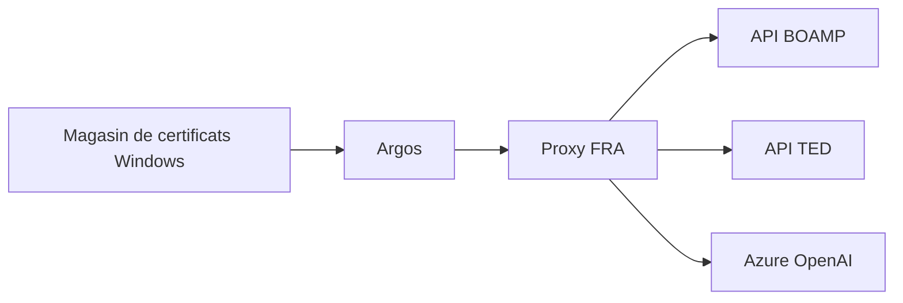

# Réseau et sources

## Chemin réseau

Les clients HTTP conservent la validation TLS. `truststore` branche le magasin de certificats du système afin de prendre en compte les autorités d'entreprise.

## BOAMP

- Transport : `requests.Session`, requêtes GET.
- API : dataset BOAMP OpenDataSoft/Huwise.
- Filtrage : recherche plein texte et période de publication.
- Pagination : 100 résultats par appel.
- Plafond : 300 avis lus par groupe de mots-clés.
- Délai : 30 secondes par appel.
- Lien : URL de l'avis lorsqu'elle est fournie, sinon URL de recherche ou d'enregistrement API.

Le scraper sélectionne uniquement les champs utiles afin de limiter la taille des réponses.

## TED / JOUE

- Transport : `requests.Session`, requêtes POST JSON.
- API : recherche TED v3.
- Périmètre actuel : avis actifs, lieu d'exécution `FRA`, types `cn-standard` et `cn-social`.
- Pagination : 100 résultats par appel.
- Plafond : 300 avis lus par groupe.
- Délai : 30 secondes.

Les champs de procédure et de lots sont convertis en texte brut avant classification.

## Ordre et isolation

Les sources sont appelées séquentiellement. Une panne n'empêche pas les sources suivantes lorsque `continue_on_error=True`, valeur utilisée par le pipeline.

Chaque source doit :

- utiliser les helpers de proxy et TLS communs ;
- définir un délai explicite ;
- ne jamais désactiver la validation TLS ;
- appliquer un plafond documenté ;
- produire une alerte utilisateur exploitable.
