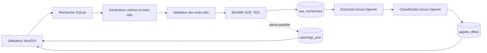

# Vue d'ensemble

## Composants

| Composant | Responsabilité |
|---|---|
| `backend/ui_app.py` | Interface, historique, prompts et affichage des résultats |
| `backend/pipeline.py` | Orchestration asynchrone et transitions de statut |
| `backend/Scrapers/` | Collecte et normalisation minimale des sources |
| `backend/IAfiltre_async.py` | Génération, extraction et classification IA |
| `backend/db/` | Schéma, migrations et accès SQLite |
| `backend/proxy_config.py` | Résolution des proxies scrapers et Azure |
| `backend/tls_config.py` | Utilisation du magasin de certificats système |
| `backend/run_packaged.py` | Démarrage de l'exécutable Windows |

## Frontières de responsabilité

- L'interface ne doit pas contenir de logique propre à une source.
- Un scraper produit des avis bruts et ne décide pas de leur pertinence.
- Le pipeline coordonne les étapes sans réimplémenter les scrapers ou la base.
- Le dépôt `db.repository` centralise les écritures et les compteurs.
- Les migrations sont idempotentes et exécutées au démarrage.
- Les erreurs de source sont persistées ; les erreurs globales modifient le statut du job.

## Concurrence

Le scraping `requests`, bloquant, est exécuté dans un thread par `asyncio.to_thread`. Les sources sont ensuite parcourues séquentiellement dans l'ordre BOAMP, EDF, TED.

Le traitement IA crée une tâche par avis brut exploitable. Un sémaphore limite à dix le nombre d'appels Azure simultanés dans le processus. SQLite utilise le mode WAL et un délai d'attente sur les écritures du traitement IA.

## Persistance locale

Argos n'utilise pas de serveur de base de données. Chaque poste conserve son historique, ses prompts et ses résultats dans un fichier SQLite. Il n'existe pas de synchronisation automatique entre deux installations.
