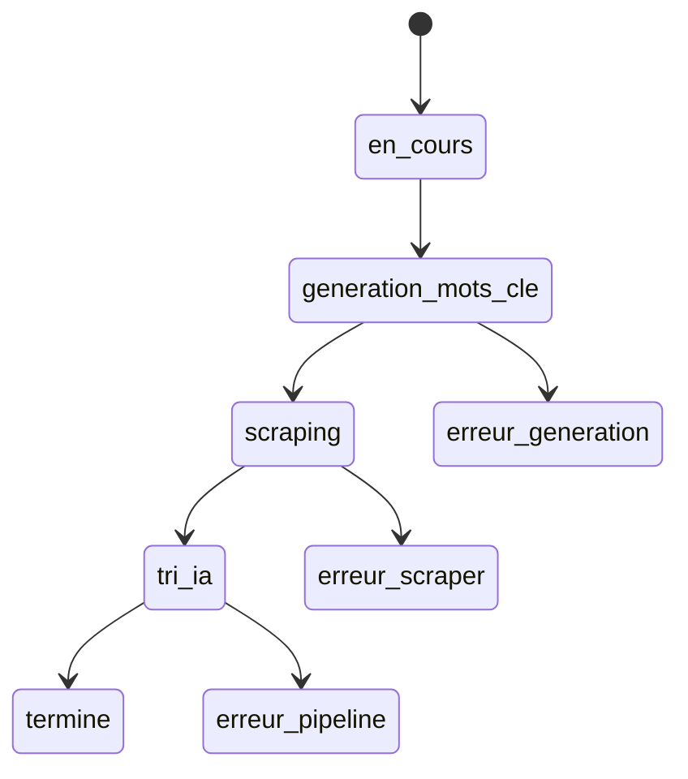

# Pipeline d'exécution

## 1. Création du job

L'interface enregistre immédiatement dans `recherches_jobs` :

- le prompt initial ;
- les sources sélectionnées ;
- la période dans `params` ;
- le statut `en_cours`.

Cette création précoce permet d'afficher et de diagnostiquer une recherche même si une étape ultérieure échoue.

## 2. Génération des critères

`generate_criteres_prompt_json()` appelle Azure OpenAI avec un schéma JSON strict. La réponse contient :

- `criteres` ;
- `regles` ;
- `mots_recherche` ;
- `titre_recherche`.

Les critères et règles sont assemblés en méta-prompt. Le titre et ce texte sont stockés dans `recherches_jobs`.

L'utilisateur peut ensuite ajouter ou supprimer des groupes de mots-clés. La requête validée est stockée sous forme de groupes séparés par des virgules.

## 3. Scraping

Le statut devient `scraping`. `run_all_scrapers()` exécute les sources sélectionnées dans cet ordre :

1. BOAMP ;
2. EDF ;
3. TED / JOUE.

Chaque source :

- applique la période ;
- exécute chaque groupe de mots-clés ;
- pagine jusqu'à épuisement ou jusqu'au garde-fou ;
- déduplique les liens dans la recherche ;
- insère les textes normalisés dans `raw_recherches` ;
- incrémente `nb_trouves`.

Par défaut, une exception est capturée et ajoutée à `warnings_json`. La boucle continue avec la source suivante.

## 4. Extraction IA

Le statut devient `tri_ia`. Pour chaque ligne brute contenant suffisamment de texte :

1. Azure reçoit le texte et les critères ;
2. le modèle produit un bloc `extraction` conforme à un schéma strict ;
3. Argos vérifie le JSON.

L'extraction contient le titre, les dates, le lieu, le budget, le type de marché, l'acheteur, la référence, le score, les tags, la raison, le secteur, le mot-clé et le lien.

## 5. Classification IA

Un second appel reçoit :

- les critères générés ;
- l'extraction structurée ;
- le contenu brut.

Il retourne uniquement `{"pertinent": true|false}`. Après validation :

- l'avis est inséré dans `appels_offres` ;
- `nb_insere` est incrémenté si l'insertion est nouvelle ;
- la ligne brute est supprimée.

Si l'extraction ou la classification échoue après les tentatives prévues, la ligne brute est conservée pour diagnostic ou retraitement.

## 6. Fin et affichage

Après le traitement de toutes les lignes, le statut devient `termine`. L'interface relit périodiquement les compteurs, les avertissements et les résultats.

!!! note "Erreur partielle"
    Une erreur EDF, BOAMP ou TED gérée par l'orchestrateur ne mène pas à `erreur_scraper`. Elle est enregistrée comme alerte et le pipeline poursuit normalement.
