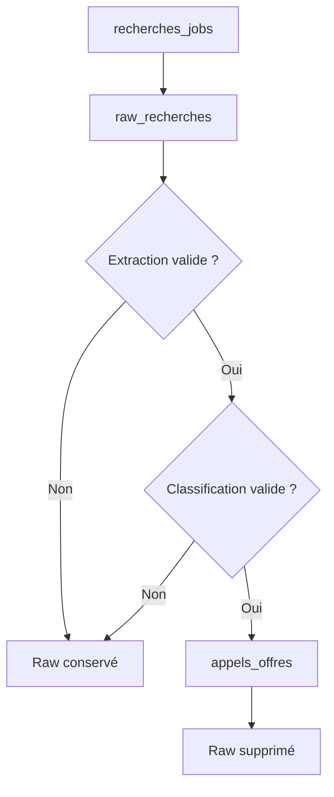

# Cycle de vie des données

## Création et initialisation

À chaque démarrage utile, Argos :

1. crée les tables absentes ;
2. crée `schema_migrations` ;
3. applique les migrations non marquées ;
4. initialise ou met à jour le référentiel des sources.

Les migrations sont transactionnelles dans l'appel d'initialisation.

## Parcours d'une recherche

### Création

Une recherche est créée avant l'appel Azure. Son prompt initial et son statut restent donc inspectables en cas d'échec.

### Collecte

Chaque scraper vérifie l'existence du lien dans les raws de la recherche. Les liens uniques sont insérés avec leur texte normalisé.

### Qualification

L'extraction et la classification sont deux appels distincts. Une insertion réussie incrémente `nb_insere`, puis supprime le raw correspondant.

### Doublons

Deux niveaux existent :

- déduplication temporaire par `(search_id, lien)` dans `raw_recherches` ;
- unicité globale de `appels_offres.lien`.

Si un lien est déjà présent dans `appels_offres`, `INSERT OR IGNORE` n'ajoute rien. Dans le flux actuel, ce cas laisse le raw en base car `safe_insert()` retourne avant sa suppression.

## Suppression

`delete_recherche_jobs()` supprime les recherches sélectionnées. La connexion active les clés étrangères ; les raws et AO rattachés sont supprimés par cascade.

Les prompts sauvegardés et le référentiel des sources restent intacts.

## Migrations existantes

| Version | Effet |
|---|---|
| `2026_03_31_raw_recherches_source` | Ajoute et renseigne la source des raws |
| `2026_04_01_source_id_columns` | Ajoute les références `source_id` |
| `2026_04_01_recherches_jobs_date_lancement` | Normalise la date de lancement |
| `2026_04_13_recherches_jobs_warnings_json` | Ajoute les alertes persistées |
| `2026_04_14_appels_offres_pertinent` | Ajoute le booléen de pertinence |
| `2026_06_18_recherches_jobs_prompt_initial` | Conserve le prompt utilisateur |
| `2026_06_23_saved_prompts` | Ajoute la bibliothèque locale |

## Ajouter une migration

1. Écrire une fonction idempotente dans `backend/db/migrations.py`.
2. Tester l'existence des colonnes ou objets avant un `ALTER`.
3. Ajouter une version unique à `MIGRATIONS`.
4. Tester sur une base neuve.
5. Tester sur une copie d'une base de production.
6. Vérifier `PRAGMA integrity_check` et les données après migration.
7. Documenter le changement dans cette page et dans `CHANGELOG.md`.

Ne jamais modifier rétroactivement le contenu d'une migration déjà distribuée. Ajouter une nouvelle version corrective.
