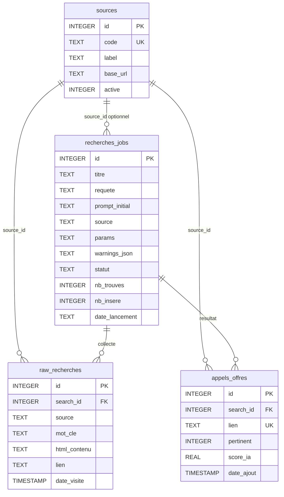

# Schéma de la base SQLite

## Emplacement

| Mode | Chemin |
|---|---|
| Développement | `<racine>/html_scrap.db` |
| Variable dédiée | valeur absolue de `ARGOS_DB_PATH` |
| Exécutable Windows | `%LOCALAPPDATA%\Argos\html_scrap.db` |

L'initialisation est assurée par `db.repository.initialize_database()`.

## Relations

La table `saved_prompts` est indépendante des recherches.

## `sources`

Référentiel technique initialisé avec :

| Code | Libellé | Actif |
|---|---|---:|
| `francemarches` | France Marchés | `0` |
| `boamp` | BOAMP | `1` |
| `ted` | TED / JOUE | `1` |
| `edf` | EDF - Portail fournisseurs | `1` |

Le registre d'exécution des scrapers reste actuellement défini dans `Scrapers/__init__.py`. Modifier uniquement `sources.active` ne retire donc pas automatiquement une source de l'interface.

## `recherches_jobs`

| Colonne | Rôle |
|---|---|
| `id` | Identifiant de la recherche |
| `titre` | Titre généré par l'IA |
| `requete` | Groupes de mots-clés validés, séparés par des virgules |
| `prompt_initial` | Texte saisi ou relancé |
| `source` | Codes des sources sélectionnées, potentiellement séparés par des virgules |
| `source_id` | Référence historique, souvent nulle en recherche multi-source |
| `params` | Paramètres JSON au lancement, puis critères textuels dans le flux actuel |
| `warnings_json` | Liste JSON d'alertes de source |
| `statut` | État du pipeline |
| `nb_trouves` | Nombre de raws uniques insérés |
| `nb_insere` | Nombre de résultats classifiés insérés |
| `date_lancement` | Horodatage de création |

!!! warning "Colonne `params`"
    Le flux actuel utilise d'abord `params` pour la période et les sources, puis l'écrase avec les critères générés. Ne pas considérer cette colonne comme un historique durable de tous les paramètres sans faire évoluer le schéma.

## `raw_recherches`

Zone de transit entre scraping et IA :

- `search_id` : recherche parente ;
- `source` et `source_id` : provenance ;
- `mot_cle` : requête ayant trouvé l'avis ;
- `html_contenu` : texte normalisé transmis à Azure ;
- `lien` : URL source ;
- `date_visite` : date d'insertion.

Une ligne est supprimée après classification et insertion réussies. Elle reste en base si l'IA ne produit pas de réponse exploitable.

## `appels_offres`

Stocke les champs extraits, la classification et le rattachement à la recherche :

- identité : titre, référence, lien, source ;
- calendrier : publication, clôture, ajout ;
- métier : acheteur, lieu, budget, type, secteur, tags, mot-clé ;
- IA : `score_ia`, `pertinent`, `raison` ;
- relation : `search_id`.

Le lien possède une contrainte unique globale. Le même avis déjà enregistré pour une ancienne recherche ne peut pas être dupliqué dans une nouvelle recherche avec le schéma actuel.

## `saved_prompts`

| Colonne | Rôle |
|---|---|
| `id` | Identifiant |
| `prompt` | Texte unique |
| `created_at` | Création |
| `updated_at` | Dernière sauvegarde ou modification |

## `schema_migrations`

Cette table interne conserve la version et la date d'application de chaque migration. Une migration déjà marquée n'est pas rejouée.

## Index

Les index principaux accélèrent :

- la recherche d'une source par code ;
- le tri des prompts ;
- la déduplication des AO par lien ;
- les résultats par recherche et pertinence ;
- la déduplication des raws par recherche, lien et source.
