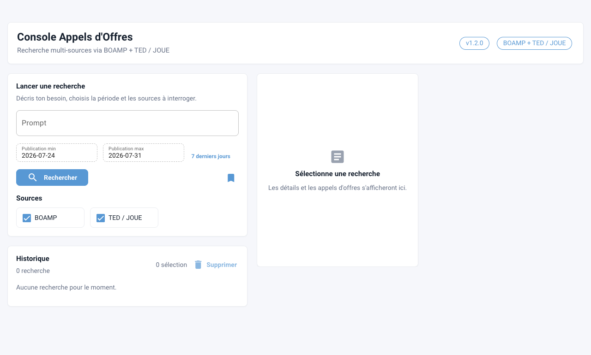

# Argos

Argos est une application de veille dédiée aux appels d'offres techniques. Elle transforme une description métier en recherches exploitables, interroge plusieurs sources publiques, qualifie les avis avec Azure OpenAI et conserve les résultats dans une base SQLite locale.

## Ce que fait l'application

1. Enregistre le prompt, la période et les sources choisies.
2. Génère un titre, des critères de pertinence et des groupes de mots-clés.
3. Laisse l'utilisateur contrôler les mots-clés avant la collecte.
4. Interroge BOAMP et TED/JOUE.
5. Déduplique et stocke les avis bruts dans SQLite.
6. Extrait les champs métier et classe chaque avis comme pertinent ou non pertinent.
7. Affiche les résultats, les compteurs et les éventuelles erreurs partielles de source.

## Parcours recommandés

- Première installation : [Installation](getting-started/installation.md).
- Première utilisation : [Première recherche](getting-started/first-search.md).
- Exploitation régulière : [Politique et calendrier de maintenance](maintenance/schedule.md).
- Comprendre les traitements : [Pipeline d'exécution](architecture/pipeline.md).
- Administrer les données : [Base SQLite](database/schema.md).
- Diagnostiquer un incident : [Dépannage](maintenance/troubleshooting.md).

## Principes d'exploitation

- Les secrets restent dans `.env` ou dans les variables protégées de GitLab CI/CD.
- Les dépendances sont résolues depuis le Nexus interne avec `uv-corporate.toml`.
- Le proxy FRA et le magasin de certificats système sont utilisés pour les flux sortants.
- Une source indisponible ne doit pas bloquer les autres sources.
- La base doit être sauvegardée avant toute migration, montée de version ou opération destructive.

!!! note "Périmètre de la documentation"
    Le site MkDocs couvre l'utilisation, l'architecture, SQLite, la maintenance, le diagnostic et la release. Le guide PDF illustré reste disponible pour la diffusion aux utilisateurs finaux.
