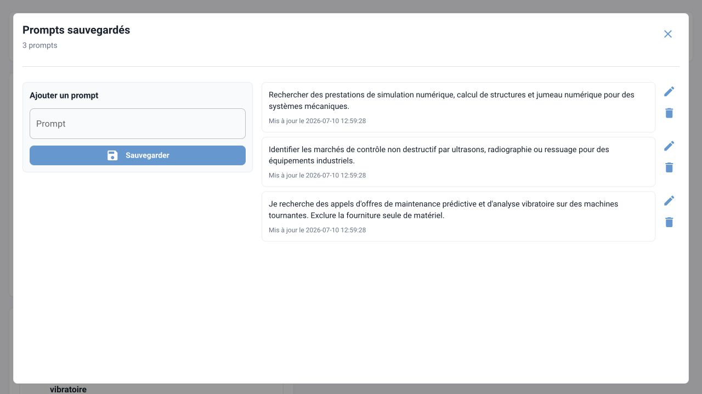
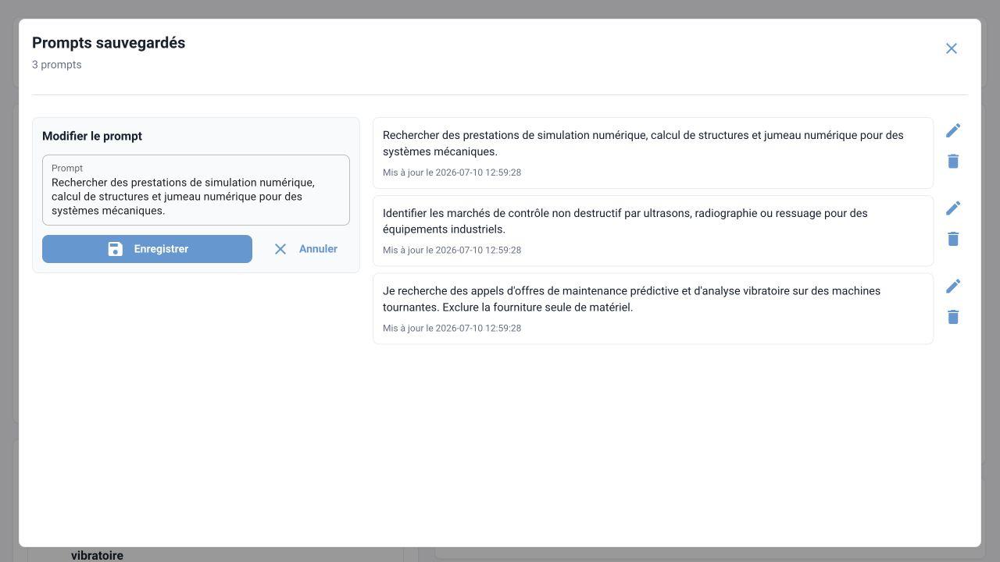

# Prompts sauvegardés

La bibliothèque de prompts permet de conserver localement des recherches récurrentes et de les relancer sans ressaisie.

## Ajouter un prompt

1. Cliquer sur l'icône de signet à côté de **Rechercher**.
2. Saisir ou coller le texte dans la zone **Prompt**.
3. Cliquer sur **Sauvegarder**.

Si le champ principal contient déjà du texte, il est repris comme point de départ à l'ouverture de la fenêtre.

## Relancer un prompt

Cliquer sur la carte du prompt. La fenêtre se ferme et une nouvelle recherche est créée avec :

- le texte sauvegardé ;
- la période actuellement choisie sur l'accueil ;
- les sources actuellement cochées.

Le prompt sauvegardé ne mémorise donc ni la période ni les sources.

## Modifier ou supprimer

- Le bouton crayon charge le prompt dans le formulaire d'édition.
- Le bouton corbeille demande une confirmation avant suppression.
- Deux prompts strictement identiques ne sont pas conservés en double.

## Stockage

Les prompts sont stockés dans la table SQLite `saved_prompts`. Ils font partie de la sauvegarde globale de la base et ne sont pas synchronisés entre les postes.

!!! warning "Données sensibles"
    Ne pas enregistrer de secret, de mot de passe, de cookie ou d'information non autorisée dans un prompt. Le texte est conservé en clair dans la base locale.
